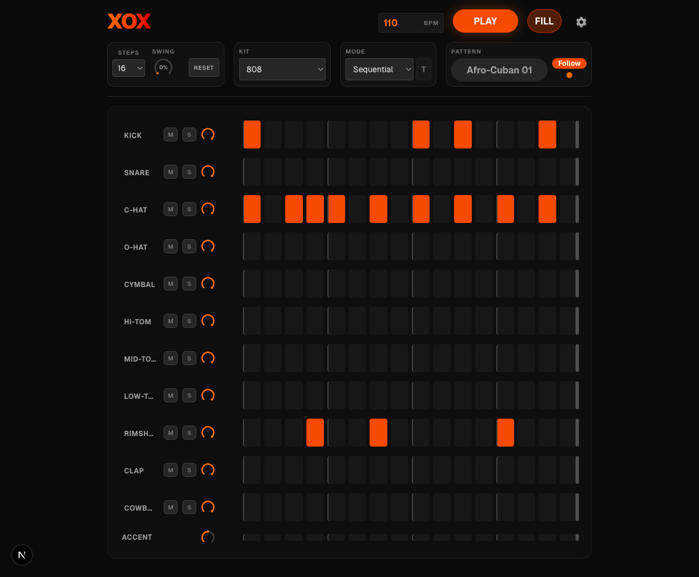

# XOX

A drum sequencer for the browser, built with Next.js and the
[Web Audio API](https://developer.mozilla.org/en-US/docs/Web/Audio_API).



## Features

### Sequencer
- **1–64 step patterns** with per-track length for polyrhythmic
  grooves
- **11 drum tracks** (kick, snare, hats, toms, rimshot, clap,
  cowbell) plus a dedicated **accent row**
- **137 built-in patterns** across 13 categories (Afro-Cuban,
  Breakbeats, Funk, Latin, Techno, and more)
- **Drag-paint editing** — click and drag to fill or erase
  steps; Shift+drag (or long-press+drag on touch) to cycle
  through per-track preset patterns
- **Pattern change modes** — Sequential (wait for boundary),
  Direct Start (reset to step 1), Direct Jump (keep position),
  with a "temp" mode.

### Playback & Mixing
- **Look-ahead scheduler** (25 ms timer, 100 ms window) for
  sample-accurate timing with zero dropouts
- **20–300 BPM** with tap-tempo detection
- **Swing** control (0–100 %)
- **Per-track gain, mute, and solo** with smart solo priority
- **Fill button** — momentary (hold) or latched (Cmd+click)

### Per-Step Controls
- **Trig conditions** — probability (1–99 %), cycle (fire on
  step *a* of every *b* repeats), and fill-conditional triggers
- **Parameter locks** — per-step gain override (0–100 %)

### Sharing & Persistence
- **URL export** — encodes the full config (kit, BPM, pattern,
  mixer state, trig conditions, p-locks) as compressed
  base64url in the URL hash
- **URL import** — paste a shared link to restore a saved
  session

### Mobile & Touch
- Long-press a step to open the trig-condition editor (with
  haptic feedback)
- Responsive layout: 8-column grid on mobile, 16-column on
  desktop

## Tech Stack

- **Framework**: [Next.js 16 (App Router)](https://nextjs.org/)
  — static export to Cloudflare Pages
- **Audio**: [Web Audio API](https://developer.mozilla.org/en-US/docs/Web/Audio_API)
- **Styling**: [Tailwind CSS v4](https://tailwindcss.com/)
- **Testing**: [Vitest](https://vitest.dev/) + jsdom

## Local Development

```bash
npm install
npm run dev        # dev server at localhost:3000
npm run build      # production build (static export)
npm run lint       # ESLint
npm test           # Vitest
```

## Architecture

Two-layer design:

1. **AudioEngine
   ([`AudioEngine.ts`](./src/app/AudioEngine.ts))** —
   singleton managing the Web Audio API. Preloads and caches
   kit samples as AudioBuffers. Core loop: `scheduler()` →
   `advanceStep()` → `playSound()`.

2. **SequencerContext
   ([`SequencerContext.tsx`](./src/app/SequencerContext.tsx))**
   — React context provider managing all UI and playback state.
   Split into ConfigContext (serializable) and TransientContext
   (ephemeral) for render isolation. Consumer API:
   `useSequencer()` → `{ state, actions, meta }`.

## Project Structure

- `src/app/` — core application source
- `src/app/data/` — JSON config for kits, patterns, tooltips
- `src/__tests__/` — Vitest test suite
- `public/kits/` — `.wav` samples organized by kit

## License

MIT
